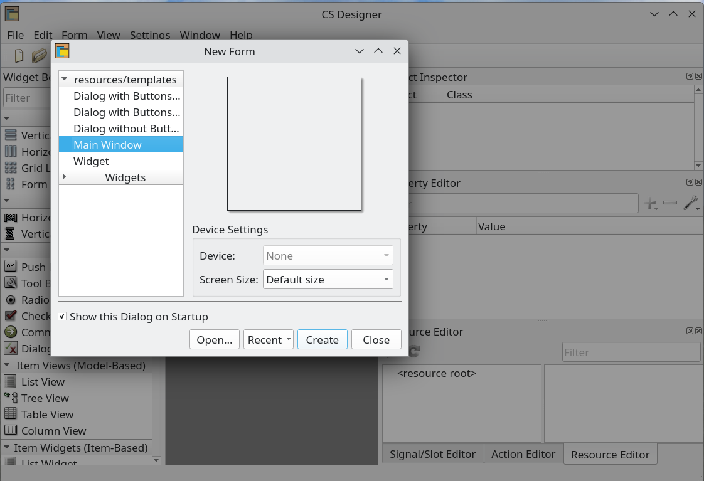
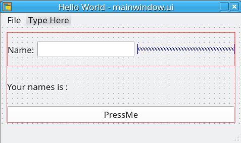
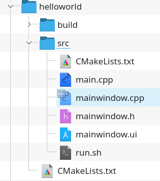
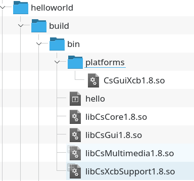
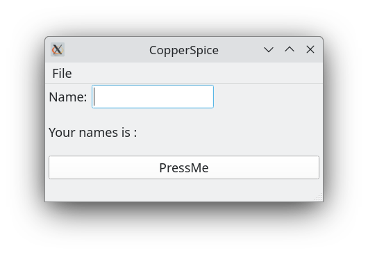
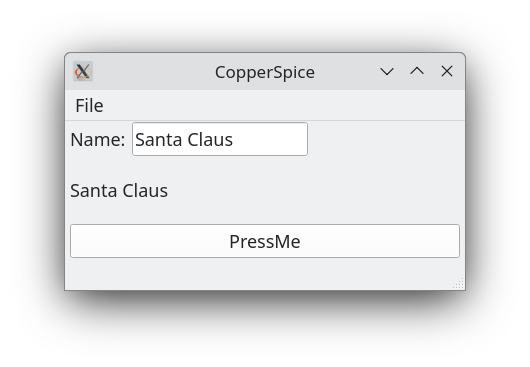

# Guide to Building CopperSpice from Source Debian 12 Bookworm


## Description


This project describes how I built CopperSpice from source on Debian 12 and wrote a simple hello world type application.

CopperSpice describes itself as "a set of individual libraries which can be used to develop cross platform software applications in C++. It is a totally open source project released under the LGPL V2.1 license and was initially derived from the Qt framework". It currently requires C++17 or newer. Their [mission statement](https://www.copperspice.com/blog.html#mission) calls CopperSpice  a set of libraries which provide a graphical interface for cross platform deployment and explains why they removed the Qt Meta-Object Compiler [moc](https://doc.qt.io/qt-6/moc.html).

### Building CopperSpice Debian 12 Bookworm

Unfortunately, a Debian [package search](https://www.debian.org/distrib/packages#search_packages) revealed that CopperSpice is not in the Debian package repositories. Also there is no pre-built CopperSpice [binary libary](https://download.copperspice.com/copperspice/) for Debian 12 at the  time of writing and so I decided to investigate building it from source. Below, I explain how I did this.

Firstly, my Debian system has a Intel® Core™ i5-6500 CPU @ 3.20GHz (4 cores) and 16GB of memory. I soon discovered that 16GB was not enough to compile the CopperSpice library and so I had to use [gparted](https://gparted.org/) to [increase swap memory](https://www.youtube.com/watch?v=mXDjhUyHrWM&t=189s) to add another 16GB. Running the free command shows the total memory available on my system for building CopperSpice.

```
free -h
               total        used        free      shared  buff/cache   available
Mem:            15Gi       2.2Gi        12Gi       355Mi       1.3Gi        13Gi
Swap:           16Gi          0B        16Gi

```
This might not seem important but it is. My first attempts at [building CopperSpice](https://www.copperspice.com/docs/cs_overview/main-build.html) from source failed (at around [832/3843) where I noticed, using the system monitor, that it needed more than 16GB (around 20GB) for compiling purposes.

To build CopperSpice I followed the instructions provided on the CopperSpice webpage for [Unix](https://www.copperspice.com/docs/cs_overview/build-unix.html). The first thing I did was install the GNU C++ compiler and cmake using the terminal commands below.

```
sudo apt update
sudo apt upgrade
sudo apt install build-essential
sudo apt install cmake
sudo apt install mesa-common-dev

```
Notice that I had added myself to the sudo group. Next I installed all the required packages as specified on the CopperSpice site.

```
sudo  apt-get install libfreetype6-dev libfontconfig1-dev libglib2.0-dev libgstreamer1.0-dev \
                    libgstreamer-plugins-base1.0-dev libice-dev libaudio-dev libgl1-mesa-dev libc6-dev \
                    libsm-dev libxcursor-dev libxext-dev libxfixes-dev libxi-dev libxinerama-dev \
                    libxrandr-dev libxrender-dev libxkbcommon-dev libxkbcommon-x11-dev libx11-dev
```

and

```
sudo apt-get install libxcb1-dev libx11-xcb-dev libxcb-glx0-dev libxcb-icccm4-dev libxcb-image0-dev libxcb-keysyms1-dev \
                libxcb-render0-dev libxcb-render-util0-dev libxcb-randr0-dev libxcb-shape0-dev \
                libxcb-shm0-dev libxcb-sync-dev libxcb-xfixes0-dev libxcb-xinerama0-dev libxcb-xkb-dev
```

Then I created a directory called "copperspice" in my home folder and [downloaded](https://download.copperspice.com/copperspice/source/) the
copperspice-1.8.2.tar.bz2 source file to it and extracted it into a directory called "cs_source". I then created two more directories called "cs_build" and "cs_lib". From within "cs_build" I ran the following cmake command

```
cmake -G "Ninja"  \
   -DCMAKE_BUILD_TYPE=Release  \
   -DCMAKE_INSTALL_PREFIX=~/copperspice/cs_lib  ~/copperspice/cs_source
```

Cmake is a meta-build system. It is a tool for generating the configuration files for ninja in this case. Once the cmake files had been created I ran the following commands (from within the cs_build directory)

```
ninja
ninja install
```

Ninja is the build system and takes a while (a few hours in my case) to build CopperSpice. The CopperSpice project webpage says that Ninja was selected as the build system since it is slightly faster than make (which is what I normally use) and provides better support on more platforms. The "ninja install" command puts the compiled output into  "cs_lib". The ls command shows that three directories are created inside cs_lib called "bin", "include" and "lib"

```
ls -l
total 12
drwxr-xr-x  2 alan alan 4096 Oct 28 00:47 bin
drwxr-xr-x 14 alan alan 4096 Oct 28 00:47 include
drwxr-xr-x  4 alan alan 4096 Oct 28 00:47 lib
```
You can use the "tree" command to further explore the files in each of these directories.

### Hello World CopperSpice

The first thing I did was download the CopperSpice [Designer](https://download.copperspice.com/designer/binary/) to create a simple GUI.  I downloaded and used the Debian 11 version of Designer.



I created a simple MainWindow application as shown below and saved it as mainwindow.ui in the src folder of the helloworld project folder that I had created. The user interface design is shown below.





### Coding the Application

The project directory structure for the hello world application is shown below.




Using a code editor (Visual Studio Code  or Geany can be used) you need to create within the src folder the following files

```
main.cpp
mainwindow.h
mainwindow.cpp
```
You also need to create two CMakeLists.txt files one inside the src folder and the other in the top level helloworld application folder.

The main.cpp is the program entry point

```
#include "mainwindow.h"
#include <QApplication>

int main(int argc, char *argv[])
{
    QApplication a(argc, argv);
    MainWindow w;
    w.show();

    return a.exec();
}
```
The mainwindow.h and mainwindow.cpp are the header and source files for the mainwindow.ui user interface (XML) file created by the CopperSpice Designer. The mainwindow.h file is shown below.

```
#ifndef MAINWINDOW_H
#define MAINWINDOW_H

#include <QMainWindow>

namespace Ui {
class MainWindow;
}

class MainWindow : public QMainWindow
{
    CS_OBJECT(MainWindow)

public:
    explicit MainWindow(QWidget *parent = nullptr);
    ~MainWindow();

private :

    CS_SLOT_1(Private, void on_pushButton_clicked())
    CS_SLOT_2(on_pushButton_clicked)

    CS_SLOT_1(Private, void on_actionExit_triggered())
    CS_SLOT_2(on_actionExit_triggered)


private:
    Ui::MainWindow *ui;

};

#endif // MAINWINDOW_H
```
Notice that the MainWindow class uses CS_OBJECT and not the Q_OBJECT macro as would be the case in a Qt application.

The moc program is a code generator which produces boilerplate code containing the implementation of the metaobject for your class. It must be run as part of the build process. CopperSpice renamed the Q_OBJECT macro to CS_OBJECT. The CS_OBJECT macro will automatically invoke templates which will register the necessary information with the CopperSpice meta object system. This replaces the need for a meta object compiler (moc). No Signal / Slot functionality was removed or lost.

The Signal/Slot system in CopperSpice can use several different types of syntax depending on what you need to declare.

a) You can use the following to declare a Slot.

```
CS_SLOT_1(Private, void on_pushButton_clicked())
CS_SLOT_2(on_pushButton_clicked)

```
b) For Slots which are connected using the method pointer syntax, you can simply declare the Slot method as shown below. Yes, Slots can be normal methods.

```
private:
   void on_pushButton_clicked();
```


The mainwindow.cpp file is shown below.

```
#include "mainwindow.h"
#include "ui_mainwindow.h"

MainWindow::MainWindow(QWidget *parent) :
    QMainWindow(parent),
    ui(new Ui::MainWindow)
{
    ui->setupUi(this);
    setWindowTitle("CopperSpice");
    QMainWindow::centralWidget()->layout()->setContentsMargins(5, 1, 5, 1);
    //Sets the left, top, right, and bottom margins to use around the layout
    QMainWindow::resize(400,200);
    QFont appfont = QApplication::font();
    appfont.setPixelSize(18); //DPI
    QApplication::setFont(appfont);
}

MainWindow::~MainWindow()
{
    delete ui;
}
void MainWindow::on_actionExit_triggered()
{
    QApplication::quit();
}

void MainWindow::on_pushButton_clicked()
{
	qDebug()<<"Pushbutton clicked";
	QString nameStr =ui->lineEdit->text();
	qDebug()<<"lineEdit Str= "<<nameStr;
    ui->labelName->setText(nameStr);

}
```

In the mainwindow constructor I set the window title, size and set the font. The on_pushButton_clicked() is the Slot method which reads the lineEdit text and displays it using the labelName.

The CMakeList files are included in the source. To compile and run the application you need  to create directory called build and then run cmake and then make as shown below.

```
mkdir build
cd build
cmake ..
make
```

Possibly the most important thing to note regarding the top level CMakeList.txt file is that you need to specify the PREFIX path for cmake to find the copperspice libraries and definitions. For example,

```
set(CMAKE_PREFIX_PATH "/home/user/copperspice/cs_lib/lib/cmake/CopperSpice")
```
where user will be your username.

When you have built the application you will find the "hello" executable in the bin folder inside the build folder. The Copperspice 1.8 shared library (*.so) files  (libCsCore, libCsGui,  libCsXcbSupport) need to be placed in the bin (deployment) directory together with any Linux GUI platform support plugins (CsGiuXcb)  which should be located inside a sub-directory called platforms as shown below.



The application can now be run (see screenshots below).






The [CopperSpice Journal](https://journal.copperspice.com/) is a series of short examples which will provide C++ developers with a general understanding about how to use the open source CopperSpice libraries.


## License

My ‘hello’ Copperspice application is licensed under BSD. CopperSpice is released under the LGPL V2.1 license.

## Project status
Maintenance mode.

## Roadmap

I am in the process of developing a talking calendar application using CopperSpice called [Casper Calendar](https://github.com/crispinalan/caspercalendar).


## Author

* **Alan Crispin** [Github](https://github.com/crispinalan)


## Acknowledgements

* [CopperSpice](https://www.copperspice.com/documentation-copperspice.html) is a set of libraries which can be used to develop cross platform  graphical applications in C++. It is an open source project released under the LGPL version 2.1 [license](https://www.copperspice.com/docs/cs_overview/main-cs-license.html)

* [CopperSpice Build Overview](https://www.copperspice.com/docs/cs_overview/build-overview.html)

* [CopperSpice Forum](https://forum.copperspice.com/)

* [CopperSpice Journal](https://journal.copperspice.com/) is a series of short examples showing how to use the open source CopperSpice libraries.

* [Geany](https://www.geany.org/) is lightweight source-code editor found in most Linux repositories including Debian 12.

* [Visual Studio Code](https://code.visualstudio.com/)  is a free source-code editor that can be used with a variety of programming languages, including  C++.
